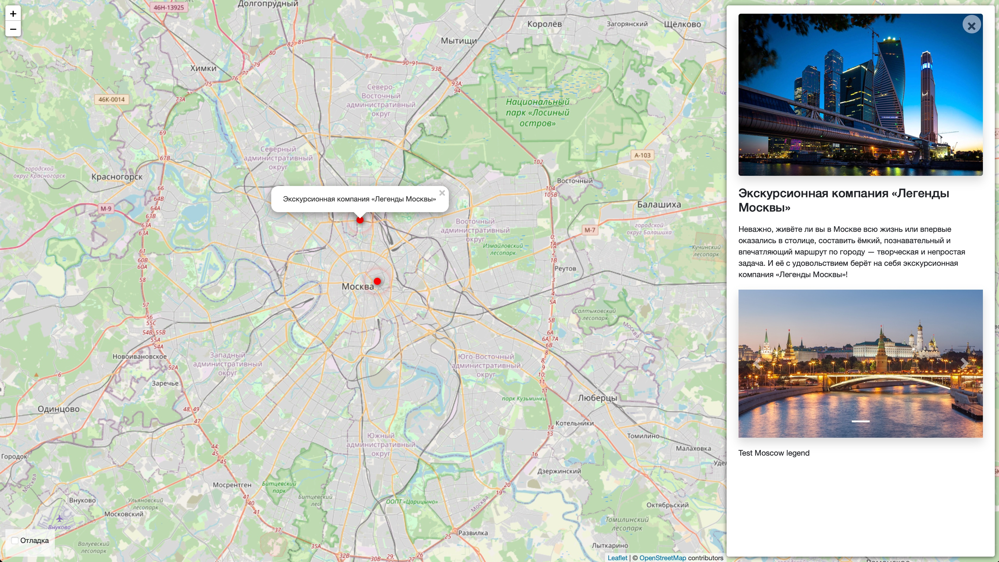

# Where to go
The web site about interesting places in your city




## Demo version on Pythonanywhere
Avaliable here: [WhereToGo](https://genapoliss.pythonanywhere.com/)

## How to run

- It's strongly recommended to use virtual enviroment for deploy. You should use Python 3.10 and Django 4 (see requirements.txt)
- Clone the repo:
```bash
git clone https://github.com/Gennadynemchin/where_to_go.git
```

- Install all requested requirements:
```bash
pip install -r requirements.txt
```
- Then make migrations:
```bash
python manage.py migrate
```
- Run server:
```bash
python manage.py runserver
```

## Env vars
Some of app settings placed in enviroment variables. For use them rename the `example.env` to `.env`
then fill out the file like this: `VARIABLE=value`.

Available variables:
- `SECRET_KEY` — Secret key of your project;
- `DEBUG_STATUS` — Debug mode;
- `ALLOWED_HOSTS` — Please follow to the link for additional information: [Django docs](https://docs.djangoproject.com/en/4.2/ref/settings/#allowed-hosts).
- `SESSION_COOKIE_SECURE` — 
- `CSRF_COOKIE_SECURE` —
- `SECURE_SSL_REDIRECT` —

